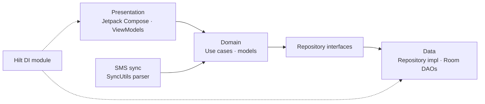

<div align="center">

# 💸 Pocket

**An Android expense manager that reads your bank SMS and turns them into organised spending.**


</div>

---

## Overview

Most people don't track spending because logging every payment by hand is tedious — yet their bank already texts them each transaction. **Pocket** reads those messages, extracts the details, and files them under your accounts and "POTs" so you can see where your money goes.

## Features

- **Multiple bank accounts** — add accounts and see them together in one dashboard.
- **POTs** — group spending into your own buckets (groceries, travel, savings, …).
- **Manual transactions** — add income or expenses by hand whenever you need to.
- **SMS sync** — scans transactional SMS from banks and wallets and extracts the amount, balance, UPI / IMPS reference, date, time and account.
- **Dashboard** — a summary of your accounts, POTs and recent activity.

### How SMS parsing works

Pocket recognises messages by sender ID and message body. Out of the box it understands senders for **HDFC, Kotak, PNB, ICICI, SBI (bank and card), Axis, Amazon Pay, Paytm and Cred**. For each message it uses regular expressions to pull out:

| Field | Examples it handles |
|---|---|
| Amount | `INR 450.00`, `Rs. 1,200`, `debited`, `credited` |
| Balance | `Avl bal`, `Available Bal INR`, `New balance: Rs.` |
| Reference | UPI ref no, IMPS ref no, transaction / txn ID |
| Date & time | `dd-MM-yy`, `dd/MM/yyyy`, `HH:mm` |

## Architecture

Pocket follows **Clean Architecture**, organised by feature. Each feature separates presentation, domain and data:



```
app/src/main/java/com/cureius/pocket/
├── feature_account/       # Add and manage bank accounts
├── feature_transaction/   # Transactions: list, add, use cases
├── feature_pot/           # POTs
├── feature_dashboard/     # Home dashboard
├── feature_sms_sync/      # SMS parsing (SyncUtils)
├── feature_navigation/    # Navigation
├── di/                    # Hilt module
└── ui/theme/              # Compose theme
```

## Tech stack

| Concern | Choice |
|---|---|
| Language | Kotlin |
| UI | Jetpack Compose, Material, Navigation Compose, Lottie |
| Architecture | Clean Architecture, MVVM, use cases |
| Dependency injection | Dagger Hilt |
| Persistence | Room |
| Async | Kotlin Coroutines |
| Min / target SDK | 21 / 32 |

## Getting started

### Prerequisites

- Android Studio (Arctic Fox or newer)
- JDK 11+
- An Android emulator or device (API 21+)

### Run it

```bash
git clone https://github.com/cureius/Pocket.git
cd Pocket
```

1. Open the project in Android Studio and let Gradle sync.
2. Run the `app` configuration on an emulator or device.
3. On first launch, add your bank accounts and POTs.
4. To try SMS sync, grant the **Read SMS** permission when prompted (use a test device with sample bank messages).

> **Privacy:** SMS parsing happens on the device. Pocket does not upload your messages.

## Project status

Pocket is a working prototype built to explore Clean Architecture and on-device SMS parsing in Compose.

- ✅ Accounts, POTs, manual transactions, dashboard and SMS parsing are implemented.
- 🗺️ Planned: spending caps per POT, weekly and monthly charts, more bank sender formats, unit tests for the SMS parser, and a CI pipeline.

## Author

Built by **Souraj Pal** — [GitHub](https://github.com/cureius) · [LinkedIn](https://www.linkedin.com/in/souraj-pal/)
